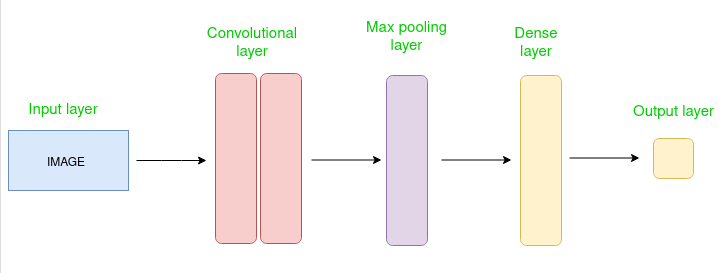
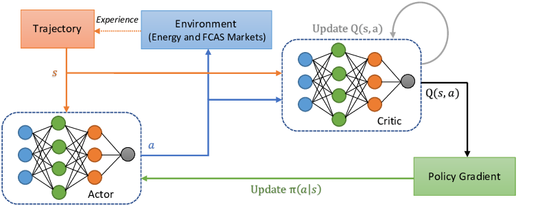
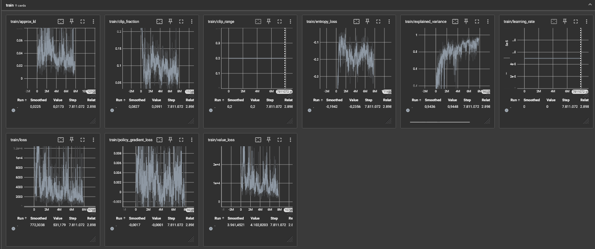

# Doom Reinforcement Learning

## About this Project
### Table of Contents
1. [Introduction](#introduction)
2. [Convolutional Neural Network (CNN)](#convolutional-neural-network-cnn)
3. [Proximal Policy Optimization (PPO)](#proximal-policy-optimization-ppo)
4. [The Setup](#the-setup)
5. [The Result](#the-result)
6. [Building ViZDoom from Source](#building-vizdoom-from-source)
   - [Dependencies](#dependencies)
     - [Linux](#linux)
       - [apt-based Distros (Ubuntu, Debian, Linux Mint, etc.)](#apt-based-distros-ubuntu-debian-linux-mint-etc)
   - [The Rest of the Dependencies](#the-rest-of-the-dependencies)

### Introduction 
This project was done for the class "17348 Machine Learning" and covers reinforcement learning using Proximal Policy Optimization (PPO) and a Convolutional Neural Network (CNN), also defined as a subset of machine learning. The CNN can also be classified as my ActorCriticPolicy.

### What is Convolutional Neural Network (CNN)

A CNN is a type of deep neural network designed for analyzing visual data. It employs convolutional layers to automatically learn hierarchical representations of features within the input data.

### What is Proximal Policy Optimization (PPO)

PPO is a reinforcement learning algorithm that balances stability and sample efficiency by constraining policy updates. It achieves this through clipping policy gradients and employing an adaptive learning rate.

### The Setup
The map the network has been trained on is `deadly_corridor.wad`, but the config has been altered to the following:

```cfg
doom_scenario_path = deadly_corridor.wad

# Skill from 1 - 5. 5 being the hardest
doom_skill = 5

# Rewards
death_penalty = 100
living_reward = +1

# Rendering options
screen_resolution = RES_320X240
screen_format = CRCGCB
render_hud = true
render_crosshair = false
render_weapon = true
render_decals = false
render_particles = false
window_visible = true

episode_timeout = 2100

# Available buttons
available_buttons =
	{
		MOVE_LEFT
		MOVE_RIGHT
		ATTACK
		MOVE_FORWARD
		MOVE_BACKWARD
		TURN_LEFT
		TURN_RIGHT
	}

# Game variables that will be in the state
available_game_variables = { HEALTH DAMAGE_TAKEN HITCOUNT SELECTED_WEAPON_AMMO }

mode = PLAYER
```

Inside the `.wsd` file, a goal and internal reward are set. In this case, it will also receive rewards for going north with the armor being the primary goal. Now, to get there on level 5 skill, it needs to shoot and kill all the guards to get to the armor. If the skill level is set to 1, the actor will just run past the guards and win that way; the same strategy cannot be used here as the actor will die on its way to the goal.

The model that runs the actor has been set up as follows:

```python
model = PPO('CnnPolicy', env, tensorboard_log=LOG_DIR, verbose=1, learning_rate=0.00005, n_steps=2048)
```

and has been configured to save a Brain file every `AmountOfSteps/10`. This ensures that only 1 in 10 quarters are lost on a crash and it also provides insight into progress, as the files can be evaluated throughout the entire training time.

As defined in the documentation in `stable_baselines3`, the network consists of 2 layers of 64 nodes each.

For values not mentioned in the above PPO definition, this is the base:

```python 
learning_rate: int = 3e-4,
n_steps: int = 2048,
batch_size: int = 64,
n_epochs: int = 10,
gamma: float = 0.99,
gae_lambda: float = 0.95,
clip_range: float = 0.2,
normalize_advantage: bool = True,
ent_coef: float = 0.0,
vf_coef: float = 0.5,
max_grad_norm: float = 0.5,
use_sde: bool = False,
sde_sample_freq: int = -1,
create_eval_env: bool = False,
verbose: int = 0,
device: str = "auto",
_init_setup_model: bool = True,
```

### The Result


Using the explained configuration [The Setup](#the-setup), the actor will consistently start winning after 5-7 million steps. 

### A Quick Explanation of the Graph

- approx_kl: Approximate Kullback-Leibler divergence between old and new policy distributions.
- clip_fraction: Proportion of clipped policy gradients in PPO algorithm.
- clip_range: Maximum deviation allowed in PPO policy updates.
- entropy_loss: Measure of policy randomness in reinforcement learning.
- explained_variance: Proportion of target variance explained by predictions.
- learning_rate: Rate at which model parameters adjust during training.
- loss: Measure of discrepancy between predicted and actual values.
- policy_gradient_loss: Loss from updating policy in reinforcement learning.
- value_loss: Loss from updating value function in reinforcement learning.

## Building ViZDoom from Source

Here we describe how to build ViZDoom from source.
If you want to install pre-built ViZDoom wheels for Python, see [Python quick start](./pythonQuickstart.md).

### Dependencies

To build ViZDoom (regardless of the method), you need to install some dependencies on your system first.

#### Linux

To build ViZDoom on Linux, the following dependencies are required:
* CMake 3.12+
* Make
* GCC 6.0+
* Boost libraries 1.54.0+
* Python 3.7+ for Python binding (optional)

Also, some additional [ZDoom dependencies](http://zdoom.org/wiki/Compile_ZDoom_on_Linux) are needed.

##### apt-based Distros (Ubuntu, Debian, Linux Mint, etc.)

To get all dependencies on apt-based Linux (Ubuntu, Debian, Linux Mint, etc.), execute the following commands in the shell (might require root access).

```sh
# All possible ViZDoom dependencies,
# most are optional and required only to support alternative sound and music backends in the engine
# others can replace libraries that are included in the ViZDoom repository
apt install build-essential cmake git libsdl2-dev libboost-all-dev libopenal-dev \
zlib1g-dev libjpeg-dev tar libbz2-dev libgtk2.0-dev libfluidsynth-dev libgme-dev \
timidity libwildmidi-dev unzip

# Only essential ViZDoom dependencies
apt install build-essential cmake git libboost-all-dev libsdl2-dev libopenal-dev

# Python 3 dependencies (alternatively, Anaconda 3 installed)
apt install python3-dev python3-pip
# or install Anaconda 3 and

 add it to PATH
```

### The Rest of the Dependencies
You will need to install the following included in the file called `req.txt`. This includes the specific versions needed for the project to work. The `requirements.txt` does the same but includes all the dependencies for `req.txt`.